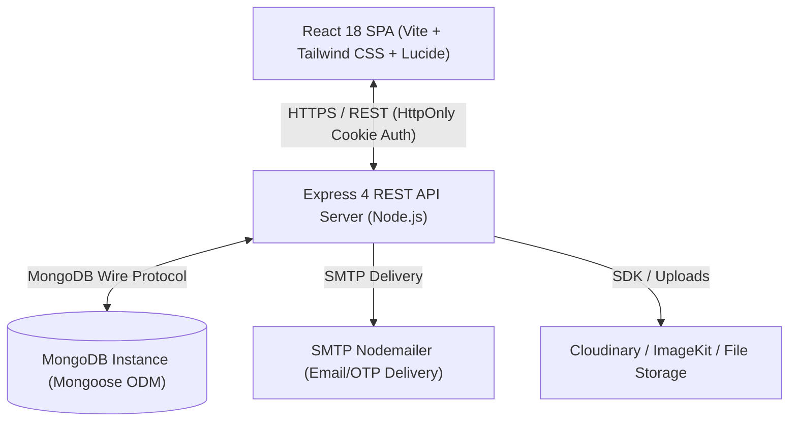
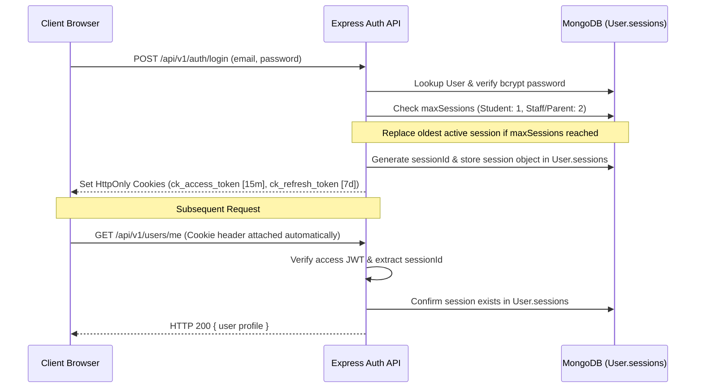

# C.K. Classes ERP — System Architecture & Design

This document details the high-level software architecture, layered design patterns, authentication lifecycle, role-based authorization, and security controls of the **C.K. Classes Coaching Institute ERP Platform**.

---

## 1. High-Level Architecture Overview

C.K. Classes ERP uses a modern **Client-Server Architecture** with strict layer separation:



---

## 2. Technology Stack

### Frontend Application
* **Framework**: React 18 with Vite
* **Routing**: React Router DOM v6
* **Styling**: Tailwind CSS, CSS Custom Properties (Design System Tokens)
* **Icons & Animation**: Lucide React, Framer Motion
* **HTTP Client**: Axios with `withCredentials: true` (HttpOnly Cookie Management)

### Backend API Server
* **Runtime**: Node.js (v18+)
* **Framework**: Express.js
* **Database Driver**: Mongoose ODM (MongoDB v6+)
* **Authentication**: JSON Web Tokens (`jsonwebtoken`), `cookie-parser`, `bcryptjs`
* **Validation**: Zod & Centralized Express Validator Middlewares
* **Logging & Utility**: Morgan, Nodemailer

---

## 3. Layered Software Design

The backend is structured into decoupled, single-responsibility layers:

```
server/src/
├── config/         # System configuration & RBAC definitions
├── controllers/    # Request/Response orchestration & HTTP status mapping
├── middlewares/    # Auth, RBAC, Rate Limiting, Error Handling, Scope Guards
├── models/         # Mongoose ODM schemas & database relationship definitions
├── routes/         # Express Router endpoints & middleware wiring
├── services/       # Core business logic & database transactions
├── utils/          # Standardized ApiError, hashing, & formatting helpers
└── validators/     # Input validation rules & schema enforcement
```

### Layer Responsibilities
1. **Routes Layer (`routes/`)**: Mounts endpoints, applies middleware chains (`verifyToken`, `requirePermission`, `scopeGuard`), and delegates execution to controllers.
2. **Controllers Layer (`controllers/`)**: Receives HTTP requests, extracts parameters, invokes services, and sends standardized JSON responses.
3. **Services Layer (`services/`)**: Implements business rules, queries models, and throws `ApiError` instances when validations or constraints fail.
4. **Models Layer (`models/`)**: Defines Mongoose schemas, indexes, data types, default values, pre-save hooks, and relationship references.

---

## 4. Authentication & Session Architecture

Authentication is powered by a **DB-backed Unified Dual-JWT Cookie Transport System**:



### Security Properties
* **HttpOnly Cookie Transport**: Access and refresh tokens are stored in `ck_access_token` (15m expiry) and `ck_refresh_token` (7d expiry) HttpOnly cookies to defend against XSS attacks.
* **Separate JWT Secrets**: `JWT_ACCESS_SECRET` and `JWT_REFRESH_SECRET` prevent token misuse.
* **Database Session Revocation**: Every JWT contains a `sessionId`. If a session is deleted from `User.sessions` (e.g., upon logout, password reset, or admin block), all requests using those cookies fail immediately.
* **Oldest Session Replacement**: When a user logs in and `maxSessions` is reached, the oldest session is automatically replaced instead of rejecting login.

---

## 5. Role-Based Access Control (RBAC) & Scope Protection

### Roles Hierarchy
Supported system roles: `admin`, `teacher`, `student`, `parent`, `receptionist`, `accountant`.

### Permission Enforcement
Permissions are centralized in `server/src/config/permissions.js` and enforced via `requirePermission(PERMISSIONS.FEATURE_ACTION)` middleware.

### IDOR & Scope Protection (`scopeMiddleware.js`)
* **Students**: Can access ONLY their own academic records (`linkedStudent`).
* **Teachers**: Can access ONLY classes, subjects, and students assigned to them (`linkedTeacher`).
* **Parents**: Can access ONLY children listed in `linkedChildren`.
* **Admins**: Granted full institutional data visibility.

---

## 6. Onboarding & Account Activation Flow

Account activation replaces public signup:

```
Admin Creates Institutional Profile (Student/Teacher)
                     │
                     ▼
Student / Teacher Obtains Unique Institution ID (e.g. CK20260021)
                     │
                     ▼
User visits /auth/activate and enters Institution ID
                     │
                     ▼
Backend dispatches 6-Digit OTP to Registered DB Email
                     │
                     ▼
User verifies OTP & receives Activation Authorization Token
                     │
                     ▼
User creates Password (satisfying Password Policy) -> Account Activated!
```
