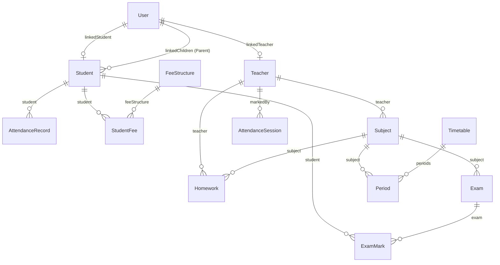

# C.K. Classes ERP — Database Documentation

This document describes the database schema, entity relationships, indexing strategy, and data integrity rules for the **C.K. Classes Coaching Institute ERP Platform**.

---

## 1. Database Overview

* **Database Engine**: MongoDB (v6.0+)
* **ODM Driver**: Mongoose ODM (v8.0+)
* **Database Name**: `ck_classes`
* **Charset**: UTF-8

---

## 2. Entity Relationship Diagram (ERD)

---

## 3. Core Database Models & Schemas

### 3.1 User Model (`User`)
Stores login credentials, role definitions, active DB sessions, and institutional profile links.

| Field | Type | Rules & Index | Description |
| :--- | :--- | :--- | :--- |
| `_id` | ObjectId | Primary Key | Unique document identifier |
| `email` | String | Required, Unique, Lowercase, Trim, Indexed | User login email address |
| `passwordHash` | String | Required | Bcrypt password hash |
| `role` | String | Required, Enum: `['admin', 'teacher', 'student', 'parent', 'receptionist', 'accountant']` | RBAC role |
| `firstName` | String | Required, Trim | User first name |
| `lastName` | String | Required, Trim | User last name |
| `phone` | String | Trim | Contact phone number |
| `isActive` | Boolean | Default: `true` | Account state |
| `linkedStudent` | ObjectId | Ref: `'Student'` | Linked student profile ID |
| `linkedTeacher` | ObjectId | Ref: `'Teacher'` | Linked teacher profile ID |
| `linkedChildren` | [ObjectId] | Ref: `'Student'` | Linked child profile IDs for parent role |
| `maxSessions` | Number | Default: `2` (Student: 1) | Max active concurrent sessions |
| `sessions` | Array | Objects `{ sessionId, refreshTokenHash, expiresAt }` | DB-backed active session records |
| `timestamps` | Date | `createdAt`, `updatedAt` | Auto-managed timestamps |

---

### 3.2 Student Model (`Student`)
Stores institutional student admission records.

| Field | Type | Rules & Index | Description |
| :--- | :--- | :--- | :--- |
| `_id` | ObjectId | Primary Key | Internal document ID |
| `studentId` | String | Unique, Indexed (Auto: `CK20260001`) | Permanent business Student ID |
| `firstName` | String | Required, Trim | Student first name |
| `lastName` | String | Required, Trim | Student last name |
| `gender` | String | Enum: `['Male', 'Female', 'Other']` | Gender |
| `dateOfBirth` | Date | Required | Date of birth |
| `email` | String | Required, Unique, Lowercase, Trim | Registered student email |
| `phone` | String | Required, Trim | Student phone number |
| `parentEmail` | String | Lowercase, Trim, Indexed | Registered parent email |
| `parentPhone` | String | Trim | Parent contact phone |
| `class` | String | Required, Trim | Class / Grade assignment |
| `status` | String | Enum: `['Active', 'Inactive', 'Graduated']` | Institutional status |

---

### 3.3 Teacher Model (`Teacher`)
Stores institutional staff and faculty records.

| Field | Type | Rules & Index | Description |
| :--- | :--- | :--- | :--- |
| `_id` | ObjectId | Primary Key | Internal document ID |
| `teacherId` | String | Unique, Indexed (Auto: `TCH0001`) | Permanent business Teacher ID |
| `firstName` | String | Required, Trim | Teacher first name |
| `lastName` | String | Required, Trim | Teacher last name |
| `email` | String | Required, Unique, Lowercase, Trim | Registered teacher email |
| `phone` | String | Required, Trim | Contact phone number |
| `dateOfBirth` | Date | Required | Date of birth |
| `qualification` | String | Trim | Academic qualification |
| `specialization` | String | Trim | Teaching subject specialization |

---

### 3.4 Attendance Models (`AttendanceSession` & `AttendanceRecord`)
* **`AttendanceSession`**: Tracks attendance marked for a specific class, subject, date, and lecture slot.
* **`AttendanceRecord`**: Tracks individual student attendance state (`Present`, `Absent`, `Late`, `Excused`).

---

### 3.5 Academic & Financial Models
* **`Subject`**: Defines subject codes, names, classes, and assigned teachers.
* **`Timetable` & `Period`**: Manages class lecture schedules, timing slots, and teacher assignments.
* **`Homework`**: Stores homework titles, descriptions, due dates, class, subject, and file attachments.
* **`Exam` & `ExamMark`**: Manages examinations, total marks, passing marks, and individual student scores.
* **`FeeStructure` & `StudentFee`**: Manages installment plans, due dates, paid amounts, payment receipts, and balance status.

---

### 3.6 Infrastructure Models
* **`Otp`**: Stores SHA-256 hashed 6-digit verification codes with TTL expiration index (5 minutes), attempt tracking (max 5), and resend cooldown (60s).
* **`PasswordResetToken`**: Stores SHA-256 hashed single-use reset and activation authorization tokens with TTL expiration index (15 minutes).

---

## 4. Referential Integrity & Deletion Rules

1. **Preservation of Institutional Data**: Deleting a `User` login account MUST NOT delete the underlying `Student` or `Teacher` profile, or any historical attendance, fee, exam, or homework records.
2. **Account Unlinking**: Deleting or deactivating a login account removes or invalidates `linkedStudent` / `linkedTeacher` references while preserving historical student/teacher profiles.
